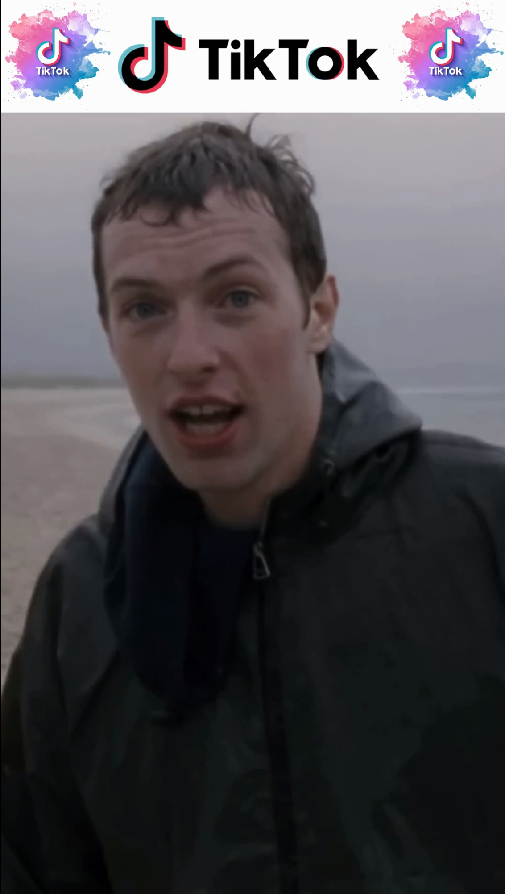

### Overview
This repo contains AI-powered *video cropping tool* that detects main person on the input video and makes smart cropping by specified frame size so this person will always be inside this frame.




### Installation

#### Installing Docker
Check `docker` is installed on your system (using terminal).
```bash
docker --version
```
If you see `docker` version after running this command, then `docker` is already installed, so you don't need to do it.

In case `docker` is not installed on your system, follow these instructions:
- [Installation guide](https://docs.docker.com/engine/install/debian/)
- [Post-installation steps](https://docs.docker.com/engine/install/linux-postinstall/)

#### Installing our video cropping tool
After `docker` is installed, we are ready to install this video cropping tool. To do this we need to build *docker image* using a simple script in the `docker` folder:
```bash
cd docker
./build_image.sh
```

After process is finished, we can check installation by running:
```bash
docker image ls
```
You should see output with installed *image* for this tool:
```
REPOSITORY       TAG       IMAGE ID        CREATED       SIZE
upwork_tiktok    tf_cpu    67c68b64b3a1    <recently>    2.41GB
```

### How to use
In order to use this tool you should specify input and output data in the `run.sh` script. To launch processing you need to run `run_tool.sh` script from the `docker` folder:
```bash
cd docker
./run_tool.sh
```

### Troubleshooting
It is possible to correct tool's behaviour in case it gives you undesirable results. For smart cropping this tool uses head detector internally. Head detector may produce false results sometimes, this is why we need to check the results of it's work. To do this we need to add `--debug_mode` flag in the `run.sh` script.

After running script with this flag we will get output video with color bboxes of the recognized main person and ROI (region of interest). There are 3 different colors for our ROI with different meanings:
- *green* - detector found main person on the current frame and we built ROI for it's location
- *red* - detector didn't find main person on the current frame, that's why we are using ROI *from previous video frame*
- *blue* - detector didn't see main person for a long time, that's why we are using *default* ROI (that is in the middle of the video frame)

The most common reason why this tool may have undesireble behaviour is because head detector may detect unwanted persons from the video frames. We can reduce amount of such false detections by adjusting `--head_score_threshold` and `--head_dim_threshold` flags in the `run.sh` script. With `--head_score_threshold` flag we can specify minimum score value of the detector (that is in range `[0.0, 1.0]`) for accepting detection (larger value leads to lower detection amount). With `--head_dim_threshold` flag we can specify minimum value (in pixels) of the width and height of the detected heads, this can help us to get rid from secondary person detections (larger value leads to lower detection amount). With debug visualization we can find *lowest* score for main person detection and *lowest* value of detection's width and height and use that as optimal parameter values.

### References
- Model was taken from [this](https://github.com/Varat7v2/Human-Head-Detection/tree/master) repo
